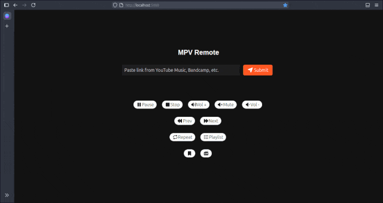

<h1 align="center">
<b>MPV-Remote</b>
</h1>

<p align="center">
    
</p>

## Overview

This Flask-based web interfaz provides a comprehensive media control interface for MPV media player, allowing users to manage bookmarks, radio stations, and control media playback through a web interface.

## Features

- **Media Playback Control**
  - Play media files from URLs
  - Pause/Resume
  - Next/Previous track
  - Volume control
  - Mute toggle
  - Stop playback
  - Playlist repeat mode

- **Bookmark Management**
  - Add new bookmarks
  - Edit existing bookmarks
  - Delete bookmarks
  - Play bookmarked URLs

- **Radio Station Management**
  - Add new radio stations
  - Edit existing radio stations
  - Delete radio stations
  - Play radio streams

- **Playlist Management**
  - Show current playlist
  - Remove tracks
  - Play any track

## Prerequisites

- <b>Python 3.9+</b>
- <b>Flask</b>
- <b>MPV Media Player</b>

### Recommended
- <b>yt-dlp</b>

## Installation

1. Clone the repository:
   ```bash
   git clone https://github.com/csq/mpv-remote.git
   cd mpv-remote
   ```

2. Install dependencies:
    ```bash
    pip install -r requirements.txt
    ```
## Configuration

**MPV socket**:

```bash
mpv --input-ipc-server=/tmp/mpv_socket --idle
```
* Ensure MPV is running with a Unix socket enabled (default name socket: mpv_socket)

## Running app
#### Default

```bash
python3 run.py
```
* The application will start on http://localhost:5000

#### Custom

```bash
python3 run.py --ipc-path /tmp/mpv_skt --host 0.0.0.0 --port 5050
```
* Example for used only in trusted network

## Project structure

```bash
mpv-remote/
│
├── app/
│   ├── __init__.py
│   ├── database.py
│   ├── static/
│   │   ├── css/
│   │   └── js/
│   └── templates/
│       ├── index.html
│       ├── bookmark/
│       └── radio/
│
├── run.py
└── requirements.txt
```
## Troubleshooting

* Ensure MPV is running with a socket enabled
* Check that the socket path is correct

## Best Usage

For an optimal experience, combine **mpv** with **yt-dlp**.

## Ideal Setup

A great way to utilize this combination is with an old smartphone running **Termux** as a jukebox.

### mpv configuration
To set up **mpv**, use the following command:

```bash
mpv --input-ipc-server=/tmp/mpv_socket --no-video --ytdl-format=bestaudio --idle
```

### mpv-remote configuration
For **mpv-remote**, run:

```bash
python3 run.py --host 0.0.0.0
```

Enjoy your enhanced media experience!
